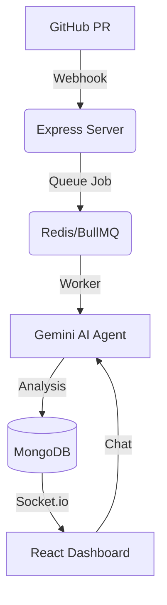

# 🛡️ SyntaxShield AI | Real-time Code Intelligence Platform

SyntaxShield is a production-grade MERN-stack application that provides automated AI code reviews via GitHub Webhooks. It uses Gemini-1.5-Flash to analyze pull requests for security vulnerabilities, performance bottlenecks, and best practices.

## 🚀 Key Features
- **AI Diagnostic Engine**: Side-by-side "Earlier Logic vs. AI Recommendation" diffs.
- **Contextual AI Chat**: Discuss specific bugs with an AI agent in real-time.
- **Intelligence Dashboard**: Data visualization of code health using Recharts.
- **System Pulse**: Live infrastructure monitoring and background task tracking.
- **Risk Scoring**: Automated severity assessment (0-100) and Technical Debt estimation.

## 🛠️ Tech Stack
- **Frontend**: React, Tailwind CSS, Recharts, Lucide Icons, Framer Motion.
- **Backend**: Node.js, Express, Socket.io (Real-time events).
- **Processing**: Redis + BullMQ (Asynchronous Task Queue).
- **Database**: MongoDB (Mongoose ODM).
- **AI**: Google Gemini-1.5-Flash API.

## 📐 Architecture

## 🛡️ Security First
- Fully isolated environment variables.
- JWT-based authentication.
- Secure GitHub OAuth integration.
- Comprehensive `.gitignore` to prevent credential leakage.

## 📦 Installation
1. Clone the repo.
2. Run `npm install` in root, frontend, and backend.
3. Configure your `.env` with GEMINI_API_KEY and MONGODB_URI.
4. Run `npm run dev`.

---
*Built for the future of automated code quality.*
